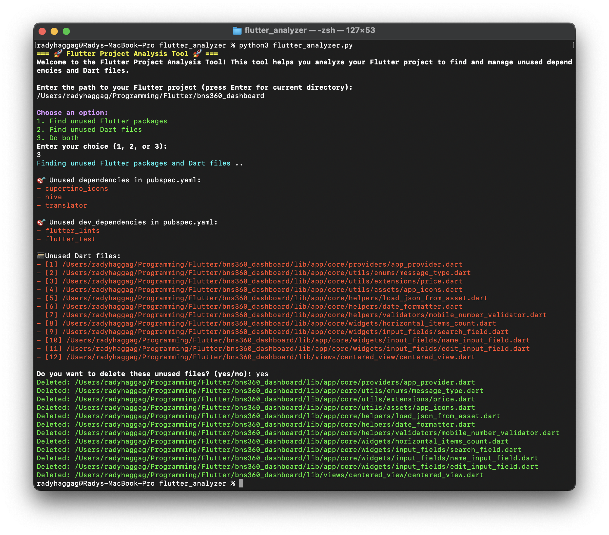

# Flutter Project Analysis Tool

 

A Python script to analyze Flutter projects, identifying unused Dart files and dependencies in `pubspec.yaml`.
  

## Features

-  **Find Unused Dependencies:** Identify unused packages and dev_dependencies in your `pubspec.yaml`.

-  **Find Unused Dart Files:** Discover Dart files in your project that are not referenced by other files.

-  **Option to Delete Unused Files:** Prompt to delete unused Dart files after analysis.

## Requirements

- Python 3.x
- Flutter project with a `pubspec.yaml`

## How to Use

**Clone Repository:**
 - git clone https://github.com/radyhaggag/flutter_analyzer_script
 - cd flutter_analyzer_script

**Copy Script:**
 - Copy flutter_analyzer.py into your Flutter project directory for easy access.

**Run Script:**
 - Navigate to your project directory and run the script:

>  `python analysis_tool.py`
	or for python3
>  `python3 analysis_tool.py`

**Follow on-screen prompts to select analysis options and manage unused files.**

**Notes**
- Ensure Python is installed and accessible via the command line.
- The script analyzes Dart files and pubspec.yaml to identify unused resources.
- Exercise caution when deleting files. Backup your project before performing deletions.